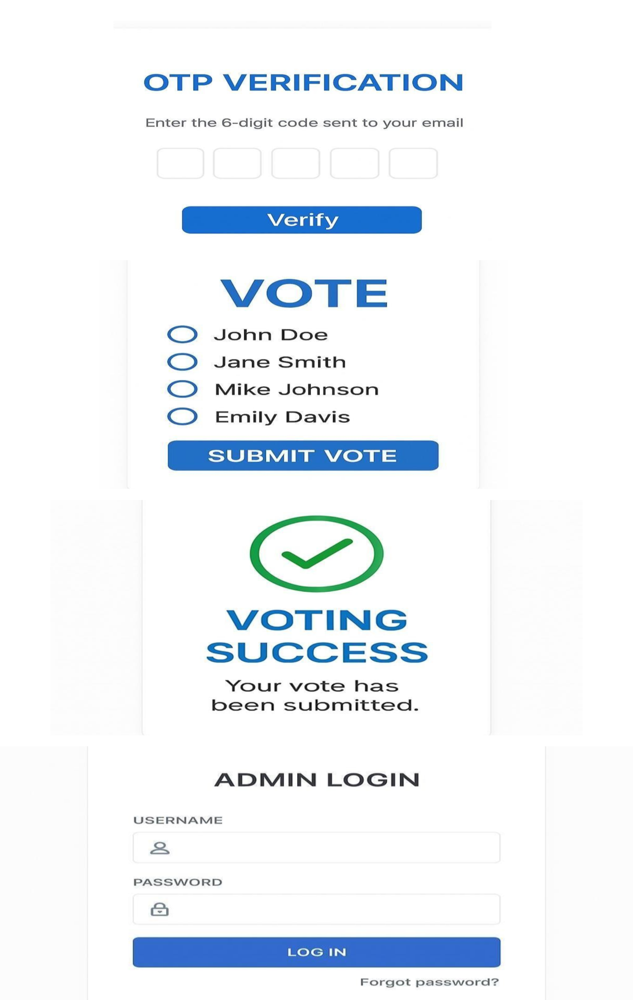

# Online Voting System with OTP Verification

## Project Overview

Online Voting System with OTP Verification is a secure web-based voting application designed to provide a reliable and authenticated voting process.

The system allows users to register, login, verify using OTP, and cast their vote securely. Admin can manage voting details and view results.

## Features

- User Registration
- User Login
- OTP Verification
- Secure Voting System
- Vote Success Confirmation
- Admin Login
- Admin Dashboard
- Result Management

## Technologies Used

- Python
- Flask
- HTML
- CSS
- JavaScript
- SQLite Database

## Project Screenshots

### Online Voting System

### Voter Login and Voting Process

### Admin Dashboard and Result

## Author

Sandhiya R
